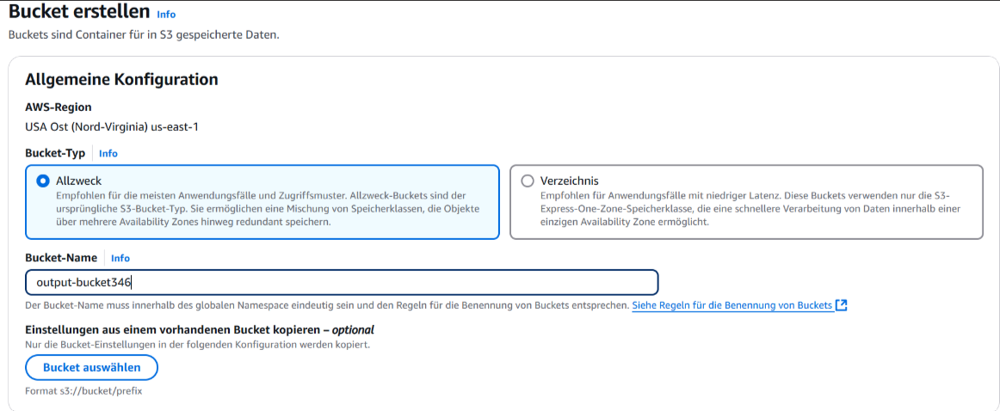
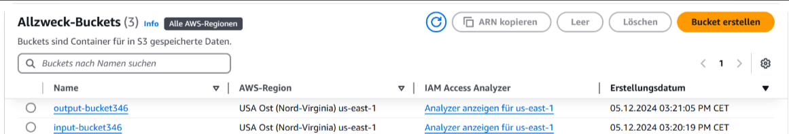

# M346-Projekt Dokumentation

## Inhalt

- [M346-Projekt Dokumentation](#projekt-dokumentation)
  - [Inhalt](#inhalt)
  - [Markdown Basics](#markdown-basics)
  - [Erste Schritte](#erste-schritte)
  - [Buckets](#buckets)
    - [Bilder](#bilder)
    - [Link](#link)
    - [Schrift](#schrift)

## Markdown Basics

### Bilder

### Link

[Alternativer Text](https://www.markdownguide.org/basic-syntax/)

### Schrift

**Bold**
_Kursiv_

- Liste
- Hallo
- Listeninhalt

## Erste Schritte

1. AWS auf der Konsole installieren. Anleitung [Hier.](https://docs.aws.amazon.com/de_de/cli/latest/userguide/getting-started-install.html)

2. Mit AWS verbinden über die Konsole. Anleitung [Hier.](https://docs.aws.amazon.com/de_de/cli/latest/userguide/getting-started-install.html)

3. Repository mit git klonen oder als Zip herunterladen und entzippen.

4. [Hier.](https://docs.aws.amazon.com/de_de/cli/latest/userguide/getting-started-install.html) in der Konsole aufrufen. Den rest erledigt das Skript.

## Buckets

Im AWS-Lab haben wir zwei neue Buckets erstellt. Ein Bucket heisst input-bucket346 dieser ist für den Input zuständig also da wird später die CSV-Datei geladen. Der zweite Bucket heisst output-bucket346 dieser ist für den Output zuständig, da wird später die JSON-Datei abgespeichert.

Auf diesem Bild seht man die Allzweck-Buckets. Da sieht man genau die zwei Buckets die wir erstellt haben.

