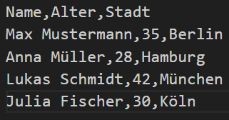

# M346-Projekt Dokumentation

## Inhalt

- [M346-Projekt Dokumentation](#m346-projekt-dokumentation)
  - [Inhalt](#inhalt)
  - [Buckets](#buckets)
  - [Skripts](#skripts)
    - [Bash-Skript](#bash-skript)
    - [Ablauf des Bash-Skripts](#ablauf-des-bash-skripts)
    - [Bash-Skript Voraussetzungen](#bash-skript-voraussetzungen)
    - [Parameter](#parameter)
    - [Wichtige Funktionen](#wichtige-funktionen)
  - [Lambda Script](#lambda-script)
    - [Ablauf der Lambda Funktion](#ablauf-der-lambda-funktion)
    - [Lambda Funktion Voraussetzungen](#lambda-funktion-voraussetzungen)
  - [Fazit](#fazit)
  - [Tests](#tests)
    - [Test-Script](#test-script)
    - [Test.csv](#testcsv)
  - [Prozess](#prozess)
    - [Arbeitsverteilung](#arbeitsverteilung)
    - [Reflexion](#reflexion)
      - [Schwierigkeiten bei dem Projekt](#schwierigkeiten-bei-dem-projekt)
      - [Persönliche Reflexion Elisa](#persönliche-reflexion-elisa)
      - [Persönliche Reflexion Anika](#persönliche-reflexion-anika)
      - [Persönliche Reflexion Emilija](#persönliche-reflexion-emilija)

## Buckets

Im AWS-Lab haben wir als Test zwei neue Buckets erstellt. Ein Bucket heisst input-bucket346 dieser ist für den Input zuständig also da wird später die CSV-Datei geladen. Der zweite Bucket heisst output-bucket346 dieser ist für den Output zuständig, da wird später die JSON-Datei abgespeichert.

Auf diesem Bild seht man die Allzweck-Buckets. Dort sieht man die zwei Buckets die wir erstellt haben.

## Skripts

### Bash-Skript

Das Bash-Skript automatisiert die Einrichtung eines AWS-Dienstes, der eine Lambda-Funktion mit zwei S3-Buckets verbindet. Die Funktion verarbeitet hochgeladene CSV-Dateien aus dem Eingangs-Bucket und speichert das Ergebnis im JSON-Format im Ausgangs-Bucket.

### Ablauf des Bash-Skripts

1. Einzigartige Namen generieren:
   Das Skript prüft, ob die Buckets und die Lambda-Funktion bereits existieren. Falls ja, wird ein Suffix hinzugefügt, bis eindeutige Namen gefunden werden.

2. S3-Buckets erstellen:
   Zwei Buckets werden erstellt. Einen Eingangs-Bucket für die CSV-Datei und ein Ausgangs-Bucket für die JSON-Datei.

3. Lambda-Funktion erstellen:
   Eine _.Zip_-Datei wird aus der Lambda-Quellcode-Datei _(function.cs)_ erstellt. Die Lambda-Funktion wird mit dem _.Net 6_-Runtime erstellt und registriert.

4. Berechtigungen konfigurieren:
   Die Lambda-Funktion erhält die Berechtigung, durch Ereignisse von S3 ausgelöst zu werden.

5. S3-Trigger hinzufügen
   Ein Event-Trigger wird konfiguriert, der die Lambda-Funktion auslöst, wenn eine _.csv_-Datei in den Eingangs-Bucket hochgeladen wird.

6. Abschluss:
   Die Konfiguration wird abgeschlossen, und die Namen der Buckets sowie der Lambda-Funktion werden ausgegeben.

### Bash-Skript Voraussetzungen

- AWS CLI muss installiert und konfiguriert sein.
- Eine IAM-Rolle _(LabRole)_ mit den erforderlichen Berechtigungen muss vorhanden sein.
- Die Datei _function.cs_ mit der Logik der Lambda-Funktion muss bereitliegen.

### Parameter

- _bucket1original_ und _bucket2original_: Basisnamen für die Eingangs- und Ausgangs-Buckets.
- _functionNameoriginal_: Basisname der Lambda-Funktion.
- _region_: AWS-Region, in der die Ressourcen erstellt werden.

### Wichtige Funktionen

- _create_bucket_: Erstellt S3-Buckets und wartet, bis sie verfügbar sind.
- _aws lambda create-function_: Registriert die Lambda-Funktion mit der hochgeladenen _.zip_-Datei.
- _aws s3api put-bucket-notification-configuration_: Fügt dem Eingangs-Bucket einen Trigger hinzu.

## Lambda Script

Die Funktion liest eine CSV-Datei aus einem S3-Bucket, wandelt diese in JSON um und speichert das Ergebnis in einem anderen S3-Bucket. Damit die nötigen References zum programmieren vorhanden sind, habe ich eine Solution mit der Datei function.cs darin erstellt. In der Solution habe ich die Developer Powershell geöffnet, und habe in das Verzeichnis gewechselt, indem das cs.proj File liegt. In dem Verzeichnis habe ich dann folgende Befehle ausgeführt:

dotnet add package AWSSDK.S3
dotnet add package Amazon.Lambda.Core
dotnet add package Amazon.Lambda.S3Events
dotnet add package Amazon.Lambda.Serialization.SystemTextJson

Nachdem ich diese Befehle ausgeführt hatte, waren alle Eventhandler und Objekte, welche ich zum Programmieren brauchte vorhanden. Danach musste ich nur noch die Funktion schreiben, und sie Anika zum Testen geben.

### Ablauf der Lambda Funktion

1. Trigger:
   Die Funktion wird durch ein S3-Event ausgelöst, wenn eine Datei in den Eingangs-Bucket _(input-bucket346)_ hochgeladen wird.

2. Lesen der CSV-Datei:
   Mit _GetOBjectAsync_ wird die Datei aus dem Eingangs-Bucket geladen und zeilenweise verarbeitet. Die erste Zeile dient als Header.

3. Konvertierung:
   Jede Zeile wird basierend auf den Headern und den Trennzeichen in ein JSON-Objekt umgewandelt. Das JSON wird formatiert gespeichert.

4. Speicherung der JSON-Datei:
   Mit _PutObjektAsync_ wird die JSON-Datei in den Ausgangs-Bucket _(output-bucket346)_ hochgeladen. Der Dateiname wird um _.json_ erweitert.

### Lambda Funktion Voraussetzungen

- S3-Buckets

  - Eingangs-Bucket: _input-bucket346_
  - Ausgangs-Bucket: _output-bucket346_

- Berechtigungen
  - _s3:GetObject_ für den Eingangs-Bucket
  - _s3:PutObject_ für den Ausgangs-Bucket

## Fazit

Elisa hat die Lambda-Funktion erstellt. Sie hat sich für die Programmiersprache C# entschieden da sie sich damit schon ein wenig auskennt. Die nötigen Informationen hat sie im Internet recherchiert und aus eigener Erfahrungen.

## Tests

### Test-Script

Das Test Script lädt eine CSV Datei in den Input Bucket. Dann wartet sie bis es im Output Bucket eine test.json Datei hat. Am Ende lädt das Script diese Datei noch herunter.

### Test.csv

In der _Test.csv_-Datei befinden sich unsere Informationen die wir benutzen um das ganze zu Testen.

## Prozess

### Arbeitsverteilung

Wir haben uns die Aufgaben untereinander aufgeteilt. Anika ist für das Bash-Skript verantwortlich, Elisa für die Lambda Funktion und Emilija für die Dokumentation.

### Reflexion

Auch wenn wir ab und zu etwas Probleme gehabt haben, haben wir uns wenn möglich immer in der Gruppe geholfen, oder andere Gruppen gefragt. Es war eine gute Arbeitsstimmung und alle haben ihren Part gut beigetragen.

#### Schwierigkeiten bei dem Projekt

Wir hatten Schwierigkeiten mit den Berechtigungen der Lambda Funktion.
Emilija hatte Schwierigkeiten bei der genauen Beschreibung der Schritte in der Dokumentation.
Mit der VM und AWS hatten wir auch verschiedene Schwierigkeiten.

#### Persönliche Reflexion Elisa

Ich fand das Projekt gut lösbar, da wir die Aufgaben gut untereinander aufteilen konnten und so immer gut vorwärtsgekommen sind. Wie haben gut als Gruppe zusammengearbeitet, und konnten uns gut austauschen. Ich konnte meine Funktion ziemlich schnell erledigen, da es nur ein paar Suchanfragen gebraucht hat, bis ich die Informationen gefunden habe, welche ich gebraucht habe, und ich schon viel mit C# gearbeitet hat. Dannach musste ich ein bisschen warten, bis Anika das Skript fertig geschrieben hat, damit ich testen konnte ob mein Code auch funktioniert.
Ich fand das Projekt spannend, und es hat mir definitiv geholfen, das Thema nochmal etwas besser zu verstehen, da ich mir jetzt alles besser vorstellen kann. Bei meiner Arbeit hatte ich keine grossen Schwierigkeiten, nur der Zeitdruck, den wir wegen den anderen Projekten und Prüfungen hatten.

#### Persönliche Reflexion Anika

Ich fand das Bash-Skript schreiben am Anfang sehr schwierig. Ich habe 4 Lektionen lang probiert das mit der Rolle zu schaffen. Ich habe Zuhause dann meinen Vater gefragt ob er weiss wie ich das lösen könnte. Er hat mir dann sehr schnell mit Microsoft Copilot eine Lösung präsentiert (Account nummer als Variabel reintun).

Am Freitag konnte ich mehrmals nichts mehr in die VM kopieren. Beim ersten mal hat es nach einem neustart wieder funktioniert. Beim zweiten Mal hat etwa eine Stunde lang gar nichts mehr geholfen (mehrmaliges neustarten). Ich konnte zum Glück durch ein Update meiner VM diesen Fehler wieder beheben. Das hat mir aber sehr viel Zeit gekostet da ich mein Skript nicht selbst testen konnte.

Am Ende konnte ich aber meine zwei Skripte fertigstellen.

Ich fand das Projekt eigentlich nicht schlecht, aber da wir sehr wenig Zeit haben (andere Prüfungen und Projekte) wurde es sehr knapp. Wir haben vielleicht die Aufgaben falsch priorisiert und wir hätten uns eine Planung machen sollen.

#### Persönliche Reflexion Emilija

Ich war für die gesamte Dokumentation des Projekts zuständig und habe gemeinsam mit Anika die Buckets erstellt. Dabei fiel es mir manchmal etwas schwer, die Dokumentation zu schreiben, da ich nicht alle Schritte im Detail mitverfolgt habe. Um sicherzustellen, dass die Dokumentation vollständig und korrekt ist, habe ich regelmässig nachgefragt und hilfreiches Feedback erhalten, das mir dabei geholfen hat, die Dokumentation zu verbessern und zu vervollständigen.

Ich habe gelernt, wie wichtig es ist, alles im Team abzusprechen und nachzufragen, wenn man nicht weiterkommt. Insgesamt hat mir das gesamte Projekt sehr viel Spass gemacht. Es war eine tolle Erfahrung, bei der ich mein Wissen erweitern konnte und das Thema durch die praktische Arbeit besser verstanden habe.
